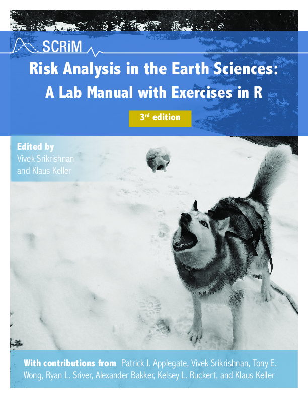

--- 
title: "Risk Analysis in the Earth Sciences"
author: 
    - Vivek Srikrishnan^[Department of Biological & Environmental Engineering, Cornell University, viveks@cornell.edu]
    - Klaus Keller^[Thayer School of Engineering, Dartmouth University, klaus.keller@dartmouth.edu]
date: "`r Sys.Date()`"
documentclass: book
bibliography: bibliography/bibliography.bib
csl: bibliography/american-geophysical-union.csl
link-citations: yes
colorlinks: yes
graphics: yes
fontsize: 11pt
mainfont: Palatino
monofont: "Source Code Pro"
monofontoptions: "Scale=0.8"
github-repo: scrim-network/raes
cover-image: images/cover_with_alexander.png
output:
  pdf_document:
    citation_package: biblatex
  bookdown::pdf_book:
    citation_package: biblatex
resource_files:
    - images/cover_with_alexander.png
---

```{r, include=FALSE}
knitr::opts_chunk$set(comment = '')
knitr::opts_chunk$set(class.output = "code-out")
```

```{julia, include=FALSE}
using Pkg
Pkg.activate(".")
Pkg.instantiate()
Pkg.update()
```

# Preface {-} 

Greenhouse gas emissions have caused considerable changes in climate, including increased surface air temperatures and rising sea levels.  Rising sea levels increase the risks of flooding for people living near the world's coastlines.  Managing such risks requires an understanding of many fields, including Earth science, statistics, and economics.  At the same time, the free, open-source programming environment [Julia](http://www.julialang.org) is growing in popularity among statisticians and scientists due to its flexibility and graphics capabilities, as well as its large collection of existing software libraries.

This textbook presents a series of exercises in Julia that teach the Earth science and statistical concepts needed for assessing climate-related risks.  These exercises are intended for upper-level undergraduates, beginning graduate students, and professionals in other areas who wish to gain insight into academic climate risk analysis.  

<a rel="license" href="http://creativecommons.org/licenses/by-nc-sa/4.0/"></a><br />

The content of this book is licensed under the [Creative Commons Attribution-NonCommercial-ShareAlike 4.0 International License](https://creativecommons.org/licenses/by-nc-sa/4.0/).


```{js, echo = FALSE}
title=document.getElementById('header');
title.innerHTML = '' + title.innerHTML
```